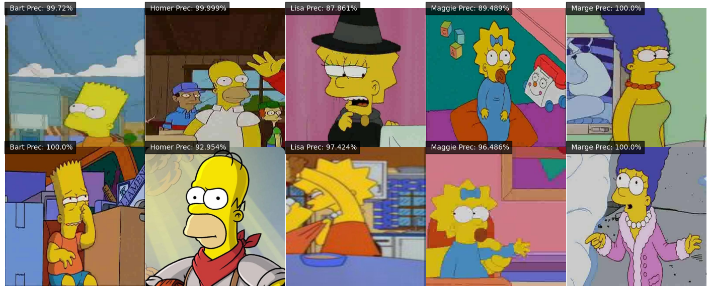
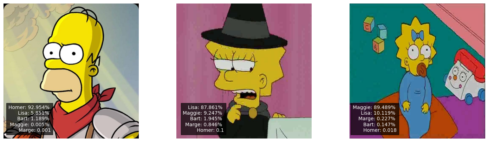

# Simpson Recognition

In this project, we delve into the realm of deep learning, employing Keras to train a Convolutional Neural Network (CNN) with the primary objective of accurately recognizing each of the five members 
constituting the Simpson family. Through meticulous training and leveraging advanced neural network architectures, we aim to achieve high precision in identifying characters such as Homer, Marge, Bart, Lisa, and 
Maggie Simpson. 

For this task, I've acquired a dataset from [Kaggle](https://www.kaggle.com/datasets/alexattia/the-simpsons-characters-dataset), where each image is labeled with just one character from the Simpson family. 
Predominantly, the majority of images predominantly feature a single 
character, facilitating a straightforward assignment of each image to a specific character.

It's noteworthy that the dataset encompasses a broader array of Simpson family characters beyond the selected five. However, owing to time constraints, I've opted to streamline the training process by focusing 
solely on the principal characters. This decision ensures a more efficient training pipeline, emphasizing the recognition accuracy of the primary characters.

## Preprocessing
I am splitting my dataset into a training set comprising 90% of the data and a validation set containing the remaining 10%, using the splitfolders function.

The initial preprocessing step involves resizing all images to a uniform size of (90, 90, 3). This standardization is crucial for consistent training across the dataset and normalize the pixel values by dividing them by 255.

To simplify the classification task, I replace character names with corresponding numerical labels. This ensures a more efficient representation of the target classes during the training process.

Moreover, I augment the training dataset by creating additional copies of each image with various effects. This augmentation strategy includes rescaling, flipping, rotation, and shifting, contributing to increased 
diversity and bolstering the model's robustness. On the other hand, for the validation dataset, only rescaling is applied to maintain accurate performance evaluation without introducing unnecessary variability.

By implementing these preprocessing techniques, we aim to establish a standardized and augmented dataset that optimally supports the training and evaluation of the convolutional neural network.

## Deep Learning Model 

The Convolutional Neural Network (CNN) has been implemented with multiple convolutional blocks. These blocks feature Conv2D layers with ReLU activation, coupled with MaxPooling for downsampling and Dropout for regularization and avoid overfitting. Concluding the architecture, the output layer, which utilizes softmax activation for multi-class classification. 

I used loss function: Categorical Crossentropy  is commonly used for multi-class classification problems , optimizer Adam a popular optimization algorithm that adapts the learning rates for each parameter individually.

## Training the model
For the training, the model was iterating over batches of training set (batch size : 32) for 20 epochs. 

### Classification Report

| Class            | Precision | Recall | F1-Score | Support |
|------------------|-----------|--------|----------|---------|
| bart_simpson     | 0.96      | 0.84   | 0.90     | 135     |
| homer_simpson    | 0.95      | 0.97   | 0.96     | 225     |
| lisa_simpson     | 0.89      | 0.96   | 0.92     | 136     |
| maggie_simpson   | 0.80      | 0.62   | 0.70     | 13      |
| marge_simpson    | 0.96      | 0.98   | 0.97     | 130     |

Accuracy: 0.94

Macro Avg Precision: 0.91, Recall: 0.87, F1-Score: 0.89

Weighted Avg Precision: 0.94, Recall: 0.94, F1-Score: 0.94

We observe a notably high accuracy rate of 94%. Each character attains a precision rate exceeding 95%, except for Maggie and Lisa, which exhibit slightly lower precision levels, possibly due to their similarities. The model faces challenges in accurately classifying these two characters.

## Testing model

Now, look at how it worked for each character with images that were not in the data used to train the model.

Now that we're observing, the model performs exceptionally well. However, it's important to note that no model can guarantee 100% security. Let's examine the three elements with lower accuracy and explore the 
probabilities assigned to other characters. 

Now, as mentioned earlier, the model encounters more challenges when trying to classify between Lisa and Maggie due to their physical similarities. It is  easier for the model to correctly discriminate among other 
characters. It is evident that achieving a high accuracy rate to distinguish between Simpsons characters is indeed possible.

In this project, achieving a high accuracy rate to distinguish between Simpsons characters is certainly feasible. However, there are certain limitations to consider. For example, in our dataset, each image 
corresponds to only one character. What if an image contains two characters? The model may encounter challenges in accurately discriminating between them because the training data lacks instances with more than 
one label per image. It's crucial to note that our current model is designed for classification and not as a comprehensive computer vision model capable of detecting and classifying multiple characters within a 
single image. To address this limitation, we are currently in the process of implementing a model using YOLO, which will allow us to achieve the desired functionality of detecting and classifying multiple 
characters within a single image.

using the YOLO library we create a new model to predict multiple characters in the same image. For this purpose we use a different dataset founded in Robotflow. 
now we test it in a video for this porpuse. 

